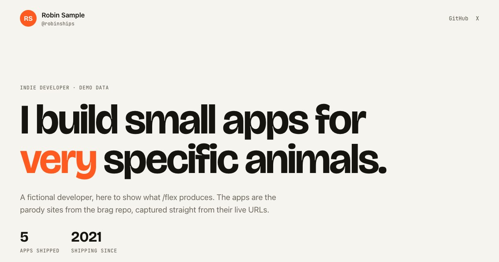

# /flex

**Everything you've shipped, on one page.**

`/flex` is an agent skill for indie developers. Point it at your apps (deployed URLs, project folders, or a folder full of projects) and it builds a one-page portfolio: every app captured actually running, with screenshots, a short looping MP4 clip, copy written from the real product, and a link to try it.

No CMS, no template to fill in, no screenshots to take by hand.



## Install

**Claude Code:**

```bash
/plugin marketplace add Meet2147/flex
/plugin install flex@flex
```

**Any other agent** via the [`skills`](https://github.com/vercel-labs/skills) CLI:

```bash
npx skills add https://github.com/Meet2147/flex --skill flex
```

Try it from a local checkout without installing: `claude --plugin-dir /path/to/flex`.

## Use it

```text
/flex https://myapp.com https://other.app ~/code/my-ios-app
```

```text
/flex ~/code            # scans the folder, asks which projects to include
/flex --add https://newapp.dev
```

You get a `portfolio/` folder:

```
portfolio/
  index.html          the whole page, styles and script inlined
  og.jpg              link-preview image
  portfolio.json      the data, yours to edit; rebuild any time
  media/<app>/        desktop.jpg, mobile.jpg, clip.mp4, meta.json
```

It is a static site. Host it free on GitHub Pages, Cloudflare Pages, Netlify or Vercel.

## How it works

1. **Gather.** Finds each app's deployed URL, or runs the project locally. Native and CLI apps use their existing screenshots.
2. **Understand.** Reads the code or the live site and writes a tagline, description, highlights and stack. Nothing invented: no fake metrics or testimonials.
3. **Capture.** `scripts/capture.mjs` drives a headless browser: desktop and phone screenshots, plus a clip recorded from a scripted scroll or a click-and-type plan, encoded with ffmpeg. It also reads each app's colours so every section takes on its app's accent.
4. **Build.** `scripts/build.mjs` turns `portfolio.json` into the page. Clips load and play only while on screen, and respect reduced-motion.

The scripts work on their own too:

```bash
npm install --prefix skills/flex/scripts
node skills/flex/scripts/capture.mjs --url https://myapp.com --out portfolio/media/myapp
node skills/flex/scripts/build.mjs portfolio/portfolio.json --og
```

## Requirements

- An agent that supports Agent Skills
- Node.js 20+
- FFmpeg on `PATH`
- Chromium via Playwright, or Chrome already installed

## Demo

[`examples/demo/`](examples/demo/) is a page for a fictional developer. Its "apps" are the parody product sites from [brag](https://github.com/latent-spaces/brag) (MIT), captured from their live URLs. Serve the folder to view it: `python3 -m http.server --directory examples/demo`.

## Credits

Inspired by [/brag](https://github.com/latent-spaces/brag), which makes a launch video for one project. `/flex` makes the page for all of them.

MIT licensed. Product and pricing notes are in [docs/BUSINESS.md](docs/BUSINESS.md).
