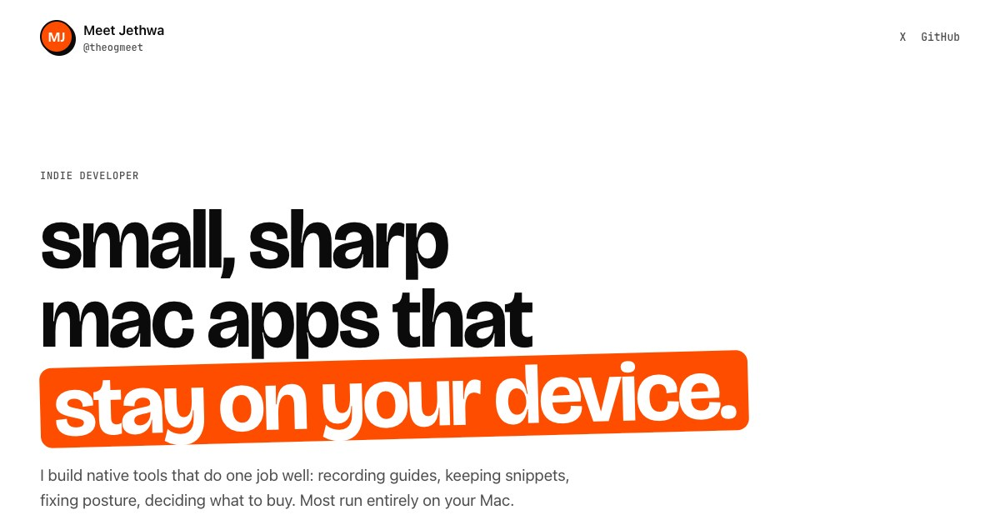
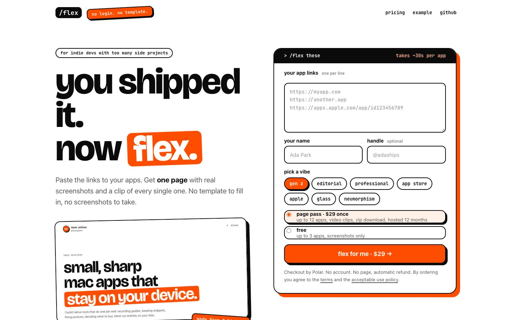
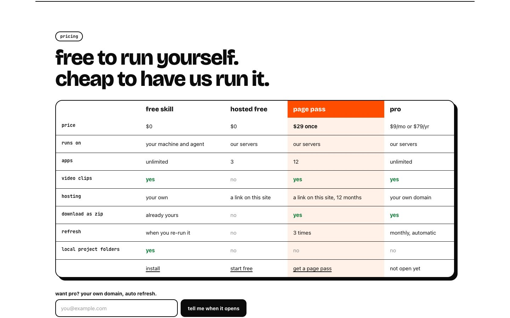
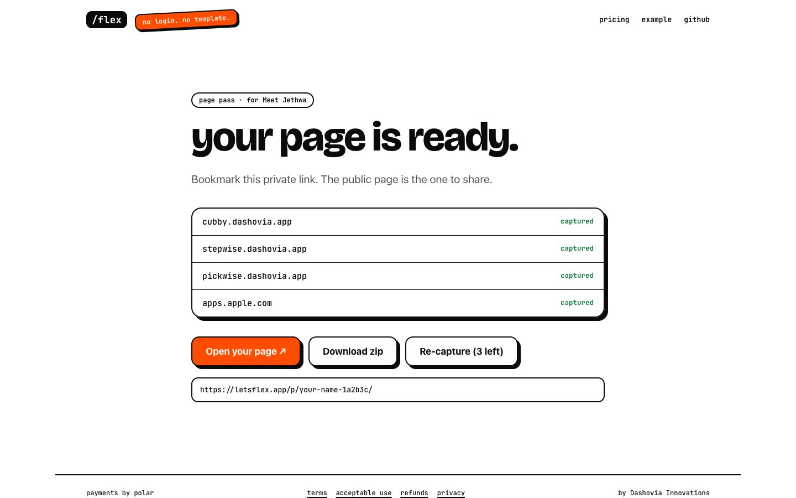
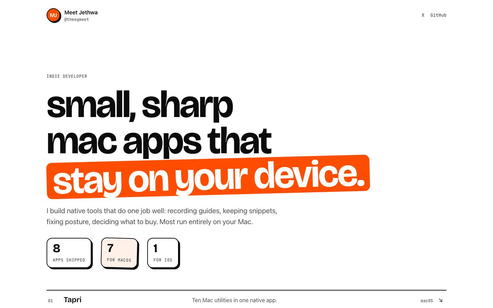
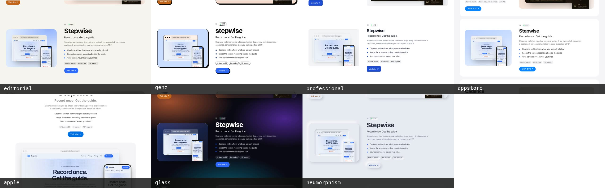
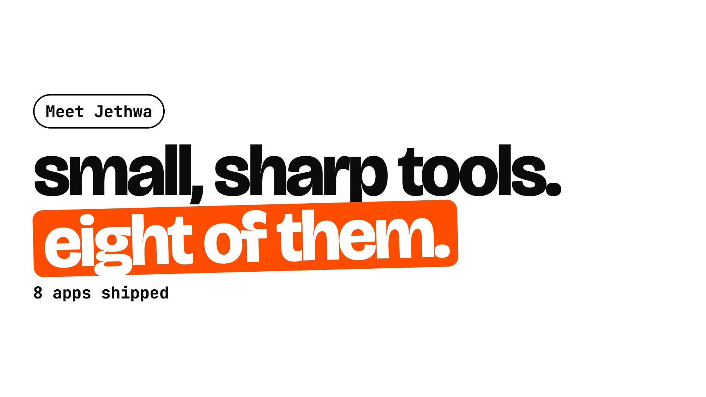

# /flex

**You shipped it. Now flex.**

> **Want a page without running `/flex` yourself?** Paste your app links at [letsflex.app](https://letsflex.app).

[](https://letsflex.app/example/)

`/flex` is an agent skill for indie developers. Point it at your apps (deployed URLs, project folders, or a folder full of projects) and it builds a one-page portfolio: every app captured actually running, with screenshots, a short looping MP4 clip, copy written from the real product, and a link to try it.

No CMS, no template to fill in, no screenshots to take by hand.

## Rather not run it yourself? Use letsflex.app

[letsflex.app](https://letsflex.app) runs `/flex` for you. Paste your links, pick a style, and get a hosted page a few minutes later. Three apps with screenshots are free; a Page Pass ($29, once) covers twelve apps with video clips and a zip download. No account.

The skill stays free and open source. Install it below and run it yourself anytime.

| | |
|---|---|
|  |  |
| **Paste your links, pick a vibe.** No account. | **Free for 3 apps.** $29 once for 12, with video. |
|  |  |
| **Watch each app get captured,** then open your page. | **The result:** one page, every app, real screenshots and clips. |

## Install

**Claude Code:**

```bash
/plugin marketplace add Meet2147/flex
/plugin install flex@flex
```

**Any other agent** via the [`skills`](https://github.com/vercel-labs/skills) CLI:

```bash
npx skills add https://github.com/Meet2147/flex --skill flex
```

Try it from a local checkout without installing: `claude --plugin-dir /path/to/flex`.

## Use it

```text
/flex https://myapp.com https://other.app ~/code/my-ios-app
```

```text
/flex ~/code                              # scans the folder, asks which projects to include
/flex --add https://newapp.dev            # add an app to an existing page
/flex --style glass https://myapp.com     # pick the look
/flex --tone "dry, like release notes"    # steer the look and the words in your own terms
/flex --reel vertical                     # also make a short video of the whole portfolio
```

You get a `portfolio/` folder:

```
portfolio/
  index.html          the whole page, styles and script inlined
  og.jpg              link-preview image
  share-copy.txt      a caption you can post as it is
  reel.mp4            optional: every app in about 20 seconds, with music
  portfolio.json      the data, yours to edit; rebuild any time
  media/<app>/        desktop.jpg, mobile.jpg, clip.mp4, meta.json
```

It is a static site. Host it free on GitHub Pages, Cloudflare Pages, Netlify, Vercel or Render.

## Styles

One portfolio look for everyone gets boring fast, so there are seven. The same `portfolio.json` builds in any of them.



| Style | Feel | Suits |
|---|---|---|
| `editorial` | Big type on warm paper, each app tinted its own colour | The default; most portfolios |
| `genz` | White and orange, thick outlines, hard shadows, lowercase | Playful products, a loud personal brand |
| `professional` | Quiet, neutral, small radii | Job hunting, client work, B2B tools |
| `appstore` | White cards on soft grey, pill buttons | Mostly mobile apps |
| `apple` | Centred, huge headlines, lots of air, one column | A few polished apps with strong visuals |
| `glass` | Frosted panels over colour blooms; dark only | Design tools, anything visual |
| `neumorphism` | One soft surface, raised and pressed shapes; light only | Calm utilities, a small set of apps |

Ask for one in plain language ("make it glass") or with `--style`. To change an existing page, set `"style"` under `"theme"` in `portfolio.json` and rebuild:

```bash
node skills/flex/scripts/build.mjs portfolio/portfolio.json --og
```

The style also sets the voice of the copy: `genz` gets short, casual lines, `professional` gets complete, measured sentences. Nothing is invented in any of them.

## Reel

A page is for people who click. A reel is for the feed. `/flex --reel` cuts every app's captured clip into one short video: your headline, each app with its name and tagline, and your link at the end.



```bash
node skills/flex/scripts/reel.mjs portfolio/portfolio.json                    # 1920×1080, for X and LinkedIn
node skills/flex/scripts/reel.mjs portfolio/portfolio.json --format vertical  # 1080×1920, for Reels, Shorts, TikTok
node skills/flex/scripts/reel.mjs portfolio/portfolio.json --format square    # 1080×1080
```

It runs 12 to 22 seconds at 120 bpm, every cut lands on a beat, and the soundtrack is synthesized on the spot, so there are no audio files to license. It takes under a minute, because the clips were already captured for the page. For a full launch video of one app, use [/brag](https://github.com/latent-spaces/brag).

## How it works

1. **Gather.** Finds each app's deployed URL, or runs the project locally. Native and CLI apps use their existing screenshots; App Store links use the listing's own.
2. **Understand.** Reads the code or the live site and writes a tagline, description, highlights and stack. No fake metrics or testimonials.
3. **Capture.** `scripts/capture.mjs` drives a headless browser: desktop and phone screenshots, plus a clip recorded from a scripted scroll or a click-and-type plan, encoded with ffmpeg. Intro and "tap to enter" screens are clicked through automatically. It also reads each app's colours so every section takes on its app's accent.
4. **Build.** `scripts/build.mjs` turns `portfolio.json` into the page in the chosen style. Clips load and play only while on screen, and respect reduced-motion.

The scripts work on their own too:

```bash
npm install --prefix skills/flex/scripts
node skills/flex/scripts/capture.mjs --url https://myapp.com --out portfolio/media/myapp
node skills/flex/scripts/build.mjs portfolio/portfolio.json --og
```

## Requirements

- An agent that supports Agent Skills
- Node.js 20+
- FFmpeg on `PATH`
- Chromium via Playwright, or Chrome already installed

## What's in this repo

- `skills/flex/` — the skill: instructions, the capture, build and reel scripts, the page template and its seven styles
- `app/` — the hosted service behind letsflex.app; see [app/README.md](app/README.md)
- `examples/demo/` — a page for a fictional developer, built from the parody product sites in [brag](https://github.com/latent-spaces/brag) (MIT)
- `docs/` — product and pricing notes
- `.claude-plugin/` — Claude Code plugin manifest and marketplace catalog
- `.claude/skills/flex`, `.agents/skills/flex` — symlinks so agents find the skill in a local checkout

## Credits

Inspired by [/brag](https://github.com/latent-spaces/brag), which makes a launch video for one project. `/flex` makes the page for all of them.

MIT licensed.
